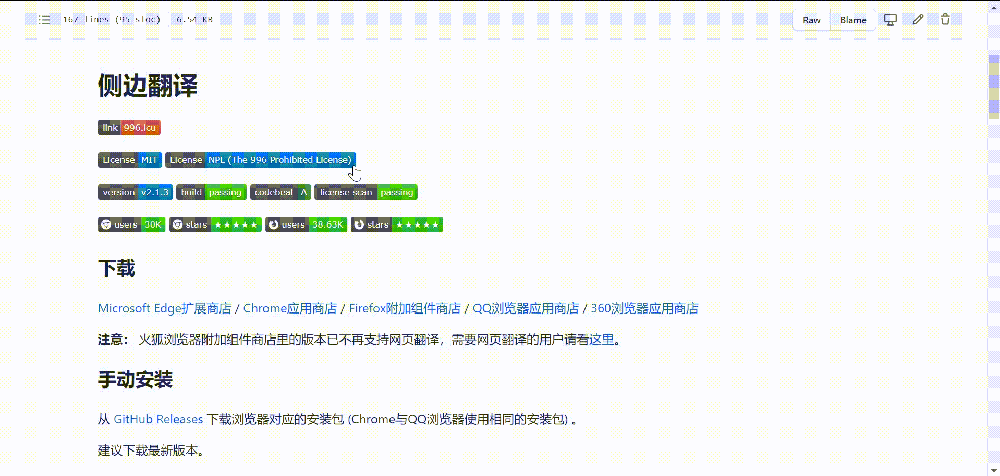

# Edge Translate

[](https://996.icu)

[](https://github.com/EdgeTranslate/EdgeTranslate/blob/master/LICENSE.MIT)
[-blue.svg>)](https://github.com/EdgeTranslate/EdgeTranslate/blob/master/LICENSE.NPL)

[](https://github.com/EdgeTranslate/EdgeTranslate/releases)
[](https://travis-ci.com/github/EdgeTranslate/EdgeTranslate)
[](https://codebeat.co/projects/github-com-edgetranslate-edgetranslate-master)
[](https://app.fossa.io/projects/git%2Bgithub.com%2FEdgeTranslate%2FEdgeTranslate?ref=badge_shield)

[![Microsoft Edge Add-ons](https://img.shields.io/badge/dynamic/json?logo=data:image/svg+xml;base64,PD94bWwgdmVyc2lvbj0iMS4wIiBzdGFuZGFsb25lPSJubyI/PjwhRE9DVFlQRSBzdmcgUFVCTElDICItLy9XM0MvL0RURCBTVkcgMS4xLy9FTiIgImh0dHA6Ly93d3cudzMub3JnL0dyYXBoaWNzL1NWRy8xLjEvRFREL3N2ZzExLmR0ZCI+PHN2ZyB0PSIxNjI1NDYxNTI3NTY0IiBjbGFzcz0iaWNvbiIgdmlld0JveD0iMCAwIDEwMjQgMTAyNCIgdmVyc2lvbj0iMS4xIiB4bWxucz0iaHR0cDovL3d3dy53My5vcmcvMjAwMC9zdmciIHAtaWQ9IjI0MTQiIHhtbG5zOnhsaW5rPSJodHRwOi8vd3d3LnczLm9yZy8xOTk5L3hsaW5rIiB3aWR0aD0iMzIiIGhlaWdodD0iMzIiPjxkZWZzPjxzdHlsZSB0eXBlPSJ0ZXh0L2NzcyI+PC9zdHlsZT48L2RlZnM+PHBhdGggZD0iTTQ2NCA2NTZxLTQ4LTUyLTU2LTExNi0yMCAzMC4wMTYtMzIgNjQtMTguMDE2IDU4LjAxNi00Ljk5MiAxMjAuOTkydDUyLjk5MiAxMTQuMDE2IDk4LjAxNiA3MS4wMDhxNjggMjQgMTUyLTggNzAuMDE2LTI2LjAxNiAxMzQuMDE2LTgyLjAxNmwxNC4wMTYtMTZxMzItMzQuMDE2IDQyLjAxNi01MC4wMTYgMjAtMzItMi4wMTYtMzYtOTguMDE2IDUyLTIxMiAzNS4wMDhUNDY0LjAzMiA2NTZ6IG0yNC0yNDhxMjQgMCAyMC45OTItNi4wMTZ0LTIwLjk5Mi0xNmwtMTYtMTAuMDE2cS02Ni4wMTYtMzYtMTQ4LTM2dC0xNDQgMzQuMDE2VDk2IDQ2OHEtMjQgNjQgMi4wMTYgMTQ2LjAxNiAzMC4wMTYgMTI2LjAxNiAxMjguOTkyIDIxNS4wMDh0MjI0Ljk5MiAxMDQuOTkycS02Ni4wMTYtNDAtMTAzLjAwOC0xMTEuMDA4VDMxMiA2NzQuMDE2cTIuMDE2LTg2LjAxNiA1MC4wMTYtMTYyLjAxNiA1MC4wMTYtODIuMDE2IDEyNi4wMTYtMTA0ek0xMTguMDE2IDM1MnE2NC00OCAxNDgtNjAuOTkydDE2NC45OTIgMTEuMDA4IDEzNS4wMDggODIuMDE2cTM2IDQwIDQ4IDkwLjAxNiAxNC4wMTYgNTYtMTQuMDE2IDk2LTM0LjAxNiAzNiA0IDYwIDI4IDE2IDkwLjAxNiAyMi4wMTYgNTYgNCA4Mi4wMTYtMi4wMTYgNzYtMTYgMTIwLTc2IDQwLTU0LjAxNiA0Mi4wMTYtMTI4Ljk5MnQtMzYtMTM5LjAwOHEtNTQuMDE2LTEwNi4wMTYtMTY0LTE2Ni4wMTYtMTA0LTU2LTIyOC01NC4wMTYtMTI4LTIuMDE2LTIzNiA3MS4wMDh0LTE1NiAxOTUuMDA4eiIgcC1pZD0iMjQxNSIgZmlsbD0iI2ZmZmZmZiI+PC9wYXRoPjwvc3ZnPg==&label=users&color=brightgreen&query=%24.activeInstallCount&url=https%3A%2F%2Fmicrosoftedge.microsoft.com%2Faddons%2Fgetproductdetailsbycrxid%2Fbfdogplmndidlpjfhoijckpakkdjkkil)](https://microsoftedge.microsoft.com/addons/detail/bfdogplmndidlpjfhoijckpakkdjkkil)
[![Microsoft Edge Add-ons](https://img.shields.io/badge/dynamic/json?logo=data:image/svg+xml;base64,PD94bWwgdmVyc2lvbj0iMS4wIiBzdGFuZGFsb25lPSJubyI/PjwhRE9DVFlQRSBzdmcgUFVCTElDICItLy9XM0MvL0RURCBTVkcgMS4xLy9FTiIgImh0dHA6Ly93d3cudzMub3JnL0dyYXBoaWNzL1NWRy8xLjEvRFREL3N2ZzExLmR0ZCI+PHN2ZyB0PSIxNjI1NDYxNTI3NTY0IiBjbGFzcz0iaWNvbiIgdmlld0JveD0iMCAwIDEwMjQgMTAyNCIgdmVyc2lvbj0iMS4xIiB4bWxucz0iaHR0cDovL3d3dy53My5vcmcvMjAwMC9zdmciIHAtaWQ9IjI0MTQiIHhtbG5zOnhsaW5rPSJodHRwOi8vd3d3LnczLm9yZy8xOTk5L3hsaW5rIiB3aWR0aD0iMzIiIGhlaWdodD0iMzIiPjxkZWZzPjxzdHlsZSB0eXBlPSJ0ZXh0L2NzcyI+PC9zdHlsZT48L2RlZnM+PHBhdGggZD0iTTQ2NCA2NTZxLTQ4LTUyLTU2LTExNi0yMCAzMC4wMTYtMzIgNjQtMTguMDE2IDU4LjAxNi00Ljk5MiAxMjAuOTkydDUyLjk5MiAxMTQuMDE2IDk4LjAxNiA3MS4wMDhxNjggMjQgMTUyLTggNzAuMDE2LTI2LjAxNiAxMzQuMDE2LTgyLjAxNmwxNC4wMTYtMTZxMzItMzQuMDE2IDQyLjAxNi01MC4wMTYgMjAtMzItMi4wMTYtMzYtOTguMDE2IDUyLTIxMiAzNS4wMDhUNDY0LjAzMiA2NTZ6IG0yNC0yNDhxMjQgMCAyMC45OTItNi4wMTZ0LTIwLjk5Mi0xNmwtMTYtMTAuMDE2cS02Ni4wMTYtMzYtMTQ4LTM2dC0xNDQgMzQuMDE2VDk2IDQ2OHEtMjQgNjQgMi4wMTYgMTQ2LjAxNiAzMC4wMTYgMTI2LjAxNiAxMjguOTkyIDIxNS4wMDh0MjI0Ljk5MiAxMDQuOTkycS02Ni4wMTYtNDAtMTAzLjAwOC0xMTEuMDA4VDMxMiA2NzQuMDE2cTIuMDE2LTg2LjAxNiA1MC4wMTYtMTYyLjAxNiA1MC4wMTYtODIuMDE2IDEyNi4wMTYtMTA0ek0xMTguMDE2IDM1MnE2NC00OCAxNDgtNjAuOTkydDE2NC45OTIgMTEuMDA4IDEzNS4wMDggODIuMDE2cTM2IDQwIDQ4IDkwLjAxNiAxNC4wMTYgNTYtMTQuMDE2IDk2LTM0LjAxNiAzNiA0IDYwIDI4IDE2IDkwLjAxNiAyMi4wMTYgNTYgNCA4Mi4wMTYtMi4wMTYgNzYtMTYgMTIwLTc2IDQwLTU0LjAxNiA0Mi4wMTYtMTI4Ljk5MnQtMzYtMTM5LjAwOHEtNTQuMDE2LTEwNi4wMTYtMTY0LTE2Ni4wMTYtMTA0LTU2LTIyOC01NC4wMTYtMTI4LTIuMDE2LTIzNiA3MS4wMDh0LTE1NiAxOTUuMDA4eiIgcC1pZD0iMjQxNSIgZmlsbD0iI2ZmZmZmZiI+PC9wYXRoPjwvc3ZnPg==&label=rating&suffix=/5.0&color=brightgreen&query=%24.averageRating&url=https%3A%2F%2Fmicrosoftedge.microsoft.com%2Faddons%2Fgetproductdetailsbycrxid%2Fbfdogplmndidlpjfhoijckpakkdjkkil)](https://microsoftedge.microsoft.com/addons/detail/bfdogplmndidlpjfhoijckpakkdjkkil)
[](https://chrome.google.com/webstore/detail/bocbaocobfecmglnmeaeppambideimao?hl=en)
[](https://chrome.google.com/webstore/detail/bocbaocobfecmglnmeaeppambideimao?hl=en)
[](https://addons.mozilla.org/firefox/addon/edge_translate/)
[](https://addons.mozilla.org/firefox/addon/edge_translate/)

## Демонстрация



## Скачать

[Надстройки Microsoft Edge](https://microsoftedge.microsoft.com/addons/detail/bfdogplmndidlpjfhoijckpakkdjkkil)
/ [Интернет-магазин Chrome](https://chrome.google.com/webstore/detail/bocbaocobfecmglnmeaeppambideimao)
/ [Дополнения для Firefox](https://addons.mozilla.org/firefox/addon/edge_translate/)
/ [QQ Browser Web Store](https://appcenter.browser.qq.com/search/detail?key=edgetranslate&id=bocbaocobfecmglnmeaeppambideimao%20&title=edgetranslate)
/ [360 Browser Web Store](https://ext.se.360.cn/webstore/detail/jkhojcaggkaojlhfddocjkkphfdkejeg)

**Внимание:** Версия в дополнениях Firefox больше не поддерживает перевод страницы. Если вам нужен перевод страницы, пожалуйста, обратитесь [сюда](./wiki/en/ToFirefoxUsers.md).

## Установка вручную

Для начала вам необходимо загрузить пакет расширения для вашего браузера (Chrome и QQ Browser используют один и тот же пакет) из [GitHub Releases](https://github.com/EdgeTranslate/EdgeTranslate/releases).

Всегда рекомендуется скачивать последнюю версию.

### Chrome

-   Извлеките пакет `.zip` на ваш диск.

-   Перейдите к: `chrome://extensions`.

-   Включите `Developer mode`. Он должен быть в правом верхнем углу страницы.

-   Нажмите `Load unpacked` в верхнем левом углу.

-   Перейдите в каталог извлеченного пакета.

### QQ Browser

-   Извлеките пакет `.zip` на ваш диск.

-   Перейдите: `qqbrowser://extensions/manage`.

-   Включите `Developer mode`. Он должен быть в правом верхнем углу страницы.

-   Нажмите `Load unpacked` в верхнем левом углу.

-   Перейдите в каталог извлеченного пакета.

### Firefox

-   В браузере Firefox установка начнется автоматически после окончания загрузки пакета `.xapi`.

### 360 Browser

-   Щелкните правой кнопкой мыши на файл пакета и выберите "Use 360 Browser to open", после чего он будет установлен автоматически.

## Сделай сам

Для сборки расширения необходимо установить [Node.js](https://nodejs.org/ru/) и [yarn](https://classic.yarnpkg.com/en/docs/install).

Клонируем репозиторий:

```shell
git clone https://github.com/EdgeTranslate/EdgeTranslate.git
```

Устанавливаем зависимости:

```shell
yarn
```

Сборка Chrome и Firefox версии:

```shell
yarn build
```

После сборки расширения вы получите распакованное расширение, соответственно, в каталогах `./packages/EdgeTranslate/build/chrome/` и `./packages/EdgeTranslate/build/firefox/`.

## Загрузите распакованное расширение в ваш браузер

### Chrome

-   Перейдите к: `chrome://extensions`.

-   Включите `Developer mode`. Он должен быть в правом верхнем углу страницы.

-   Нажмите `Load unpacked` в верхнем левом углу.

-   Перейдите к репозиторию, который вы только что клонировали, выберите `build/chrome`.

-   Теперь вы можете попробовать это расширение в Chrome.

### Firefox

-   Перейдите к: `about:debugging`.

-   Учтановите флажок `Enable add-on debugging`, если он не установлен.

-   Нажмите `Load Temporary Add-on`.

-   Перейдите к репозиторию, который вы только что клонировали, откройте `build/firefox`, выберите любой файл в этом каталоге.

-   Теперь вы можете попробовать это расширение в Firefox.

## Больше информации

[Wiki](./wiki/en/Introduction.md)

## Контакты

Электронные адреса: [nickyc975](mailto:chenjinlong2016@outlook.com), [Mark Fenng](mailto:f18846188605@gmail.com)

Telegram-канал: [Edge Translate Channel](https://t.me/EdgeTranslate)

Группа QQ: [Edge Translate QQ Group](https://jq.qq.com/?_wv=1027&k=gT5EYfFB)

Присоединяйтесь к каналу или группе, чтобы получать бета-версии Edge Translate до их выпуска.

## Лицензия

[MIT](../LICENSE.MIT) И [NPL](../LICENSE.NPL)

## Участники

<!-- ALL-CONTRIBUTORS-LIST:START - Do not remove or modify this section -->
<!-- prettier-ignore-start -->
<!-- markdownlint-disable -->
<table>
  <tr>
    <td align="center"><a href="https://nickyc975.github.io/"><br /><sub><b>Nicky Chen</b></sub></a><br /><a href="https://github.com/EdgeTranslate/EdgeTranslate/commits?author=nickyc975" title="Code">💻</a> <a href="#data-nickyc975" title="Data">🔣</a> <a href="https://github.com/EdgeTranslate/EdgeTranslate/commits?author=nickyc975" title="Documentation">📖</a> <a href="#ideas-nickyc975" title="Ideas, Planning, & Feedback">🤔</a> <a href="#maintenance-nickyc975" title="Maintenance">🚧</a></td>
    <td align="center"><a href="https://github.com/YunFeng0817"><br /><sub><b>Yun Feng</b></sub></a><br /><a href="https://github.com/EdgeTranslate/EdgeTranslate/commits?author=YunFeng0817" title="Code">💻</a> <a href="#design-YunFeng0817" title="Design">🎨</a> <a href="#mentoring-YunFeng0817" title="Mentoring">🧑‍🏫</a> <a href="#ideas-YunFeng0817" title="Ideas, Planning, & Feedback">🤔</a> <a href="#maintenance-YunFeng0817" title="Maintenance">🚧</a></td>
    <td align="center"><a href="https://github.com/tboevil"><br /><sub><b>Zia</b></sub></a><br /><a href="https://github.com/EdgeTranslate/EdgeTranslate/commits?author=tboevil" title="Code">💻</a> <a href="#design-tboevil" title="Design">🎨</a> <a href="#ideas-tboevil" title="Ideas, Planning, & Feedback">🤔</a></td>
    <td align="center"><a href="https://www.yang-bo.com/"><br /><sub><b>Yang, Bo</b></sub></a><br /><a href="https://github.com/EdgeTranslate/EdgeTranslate/commits?author=Atry" title="Code">💻</a> <a href="#ideas-Atry" title="Ideas, Planning, & Feedback">🤔</a></td>
    <td align="center"><a href="https://github.com/gdh1995"><br /><sub><b>Dahan Gong</b></sub></a><br /><a href="https://github.com/EdgeTranslate/EdgeTranslate/commits?author=gdh1995" title="Code">💻</a> <a href="#plugin-gdh1995" title="Plugin/utility libraries">🔌</a></td>
  </tr>
  <tr>
    <td align="center"><a href="https://github.com/ViktorOn"><br /><sub><b>Viktor</b></sub></a><br /><a href="#translation-ViktorOn" title="Translation">🌍</a></td>
    <td align="center"><a href="https://github.com/derlans"><br /><sub><b>derlans</b></sub></a><br /><a href="https://github.com/EdgeTranslate/EdgeTranslate/commits?author=derlans" title="Code">💻</a></td>
    <td align="center"><a href="https://github.com/Isildur46"><br /><sub><b>Isildur46</b></sub></a><br /><a href="https://github.com/EdgeTranslate/EdgeTranslate/commits?author=Isildur46" title="Code">💻</a></td>
    <td align="center"><a href="https://ykyuki.net/"><br /><sub><b>ykyuki</b></sub></a><br /><a href="#translation-ykyuki" title="Translation">🌍</a></td>
    <td align="center"><a href="https://github.com/khan-san"><br /><sub><b>Khan-San</b></sub></a><br /><a href="#translation-khan-san" title="Translation">🌍</a></td>
  </tr>
  <tr>
    <td align="center"><a href="https://axionl.me/"><br /><sub><b>ArielAxionL</b></sub></a><br /><a href="https://github.com/EdgeTranslate/EdgeTranslate/commits?author=axionl" title="Documentation">📖</a></td>
    <td align="center"><a href="https://github.com/vanja-san"><br /><sub><b>The_BadUser</b></sub></a><br /><a href="#translation-vanja-san" title="Translation">🌍</a></td>
    <td align="center"><a href="https://github.com/knlyknly"><br /><sub><b>knlyknly</b></sub></a><br /><a href="https://github.com/EdgeTranslate/EdgeTranslate/commits?author=knlyknly" title="Code">💻</a></td>
    <td align="center"><a href="https://github.com/wfk007"><br /><sub><b>fukang wang</b></sub></a><br /><a href="https://github.com/EdgeTranslate/EdgeTranslate/commits?author=wfk007" title="Documentation">📖</a></td>
  </tr>
</table>

<!-- markdownlint-restore -->
<!-- prettier-ignore-end -->

<!-- ALL-CONTRIBUTORS-LIST:END -->

## Помочь с переводом

Если вы хотите помочь локализовать Edge Translate, прочитайте следующее руководство (на английском).

[Локализация](./wiki/en/Localization.md)

## Спонсорство

Нам потребовалось много времени и сил, чтобы разработать этот проект. Если он действительно помог вам в чем-то, вы могли бы вознаградить нас банками кока-колы, чтобы поддержать нас в желании продолжать улучшать его: [PayPal](https://paypal.me/EdgeTranslate).

Но это абсолютно **добровольно**. Спонсорство не подразумевает особого отношения, и вы по-прежнему сможете свободно использовать Edge Translate и без спонсорства. Делайте это в соответствии с вашими возможностями!
