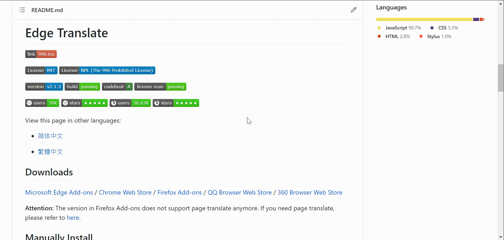

# 側邊翻譯

[](https://996.icu)

[](https://github.com/EdgeTranslate/EdgeTranslate/blob/master/LICENSE.MIT)
[-blue.svg>)](https://github.com/EdgeTranslate/EdgeTranslate/blob/master/LICENSE.NPL)

[](https://github.com/EdgeTranslate/EdgeTranslate/releases)
[](https://travis-ci.com/github/EdgeTranslate/EdgeTranslate)
[](https://codebeat.co/projects/github-com-edgetranslate-edgetranslate-master)
[](https://app.fossa.io/projects/git%2Bgithub.com%2FEdgeTranslate%2FEdgeTranslate?ref=badge_shield)

[![Microsoft Edge Add-ons](https://img.shields.io/badge/dynamic/json?logo=data:image/svg+xml;base64,PD94bWwgdmVyc2lvbj0iMS4wIiBzdGFuZGFsb25lPSJubyI/PjwhRE9DVFlQRSBzdmcgUFVCTElDICItLy9XM0MvL0RURCBTVkcgMS4xLy9FTiIgImh0dHA6Ly93d3cudzMub3JnL0dyYXBoaWNzL1NWRy8xLjEvRFREL3N2ZzExLmR0ZCI+PHN2ZyB0PSIxNjI1NDYxNTI3NTY0IiBjbGFzcz0iaWNvbiIgdmlld0JveD0iMCAwIDEwMjQgMTAyNCIgdmVyc2lvbj0iMS4xIiB4bWxucz0iaHR0cDovL3d3dy53My5vcmcvMjAwMC9zdmciIHAtaWQ9IjI0MTQiIHhtbG5zOnhsaW5rPSJodHRwOi8vd3d3LnczLm9yZy8xOTk5L3hsaW5rIiB3aWR0aD0iMzIiIGhlaWdodD0iMzIiPjxkZWZzPjxzdHlsZSB0eXBlPSJ0ZXh0L2NzcyI+PC9zdHlsZT48L2RlZnM+PHBhdGggZD0iTTQ2NCA2NTZxLTQ4LTUyLTU2LTExNi0yMCAzMC4wMTYtMzIgNjQtMTguMDE2IDU4LjAxNi00Ljk5MiAxMjAuOTkydDUyLjk5MiAxMTQuMDE2IDk4LjAxNiA3MS4wMDhxNjggMjQgMTUyLTggNzAuMDE2LTI2LjAxNiAxMzQuMDE2LTgyLjAxNmwxNC4wMTYtMTZxMzItMzQuMDE2IDQyLjAxNi01MC4wMTYgMjAtMzItMi4wMTYtMzYtOTguMDE2IDUyLTIxMiAzNS4wMDhUNDY0LjAzMiA2NTZ6IG0yNC0yNDhxMjQgMCAyMC45OTItNi4wMTZ0LTIwLjk5Mi0xNmwtMTYtMTAuMDE2cS02Ni4wMTYtMzYtMTQ4LTM2dC0xNDQgMzQuMDE2VDk2IDQ2OHEtMjQgNjQgMi4wMTYgMTQ2LjAxNiAzMC4wMTYgMTI2LjAxNiAxMjguOTkyIDIxNS4wMDh0MjI0Ljk5MiAxMDQuOTkycS02Ni4wMTYtNDAtMTAzLjAwOC0xMTEuMDA4VDMxMiA2NzQuMDE2cTIuMDE2LTg2LjAxNiA1MC4wMTYtMTYyLjAxNiA1MC4wMTYtODIuMDE2IDEyNi4wMTYtMTA0ek0xMTguMDE2IDM1MnE2NC00OCAxNDgtNjAuOTkydDE2NC45OTIgMTEuMDA4IDEzNS4wMDggODIuMDE2cTM2IDQwIDQ4IDkwLjAxNiAxNC4wMTYgNTYtMTQuMDE2IDk2LTM0LjAxNiAzNiA0IDYwIDI4IDE2IDkwLjAxNiAyMi4wMTYgNTYgNCA4Mi4wMTYtMi4wMTYgNzYtMTYgMTIwLTc2IDQwLTU0LjAxNiA0Mi4wMTYtMTI4Ljk5MnQtMzYtMTM5LjAwOHEtNTQuMDE2LTEwNi4wMTYtMTY0LTE2Ni4wMTYtMTA0LTU2LTIyOC01NC4wMTYtMTI4LTIuMDE2LTIzNiA3MS4wMDh0LTE1NiAxOTUuMDA4eiIgcC1pZD0iMjQxNSIgZmlsbD0iI2ZmZmZmZiI+PC9wYXRoPjwvc3ZnPg==&label=users&color=brightgreen&query=%24.activeInstallCount&url=https%3A%2F%2Fmicrosoftedge.microsoft.com%2Faddons%2Fgetproductdetailsbycrxid%2Fbfdogplmndidlpjfhoijckpakkdjkkil)](https://microsoftedge.microsoft.com/addons/detail/bfdogplmndidlpjfhoijckpakkdjkkil)
[![Microsoft Edge Add-ons](https://img.shields.io/badge/dynamic/json?logo=data:image/svg+xml;base64,PD94bWwgdmVyc2lvbj0iMS4wIiBzdGFuZGFsb25lPSJubyI/PjwhRE9DVFlQRSBzdmcgUFVCTElDICItLy9XM0MvL0RURCBTVkcgMS4xLy9FTiIgImh0dHA6Ly93d3cudzMub3JnL0dyYXBoaWNzL1NWRy8xLjEvRFREL3N2ZzExLmR0ZCI+PHN2ZyB0PSIxNjI1NDYxNTI3NTY0IiBjbGFzcz0iaWNvbiIgdmlld0JveD0iMCAwIDEwMjQgMTAyNCIgdmVyc2lvbj0iMS4xIiB4bWxucz0iaHR0cDovL3d3dy53My5vcmcvMjAwMC9zdmciIHAtaWQ9IjI0MTQiIHhtbG5zOnhsaW5rPSJodHRwOi8vd3d3LnczLm9yZy8xOTk5L3hsaW5rIiB3aWR0aD0iMzIiIGhlaWdodD0iMzIiPjxkZWZzPjxzdHlsZSB0eXBlPSJ0ZXh0L2NzcyI+PC9zdHlsZT48L2RlZnM+PHBhdGggZD0iTTQ2NCA2NTZxLTQ4LTUyLTU2LTExNi0yMCAzMC4wMTYtMzIgNjQtMTguMDE2IDU4LjAxNi00Ljk5MiAxMjAuOTkydDUyLjk5MiAxMTQuMDE2IDk4LjAxNiA3MS4wMDhxNjggMjQgMTUyLTggNzAuMDE2LTI2LjAxNiAxMzQuMDE2LTgyLjAxNmwxNC4wMTYtMTZxMzItMzQuMDE2IDQyLjAxNi01MC4wMTYgMjAtMzItMi4wMTYtMzYtOTguMDE2IDUyLTIxMiAzNS4wMDhUNDY0LjAzMiA2NTZ6IG0yNC0yNDhxMjQgMCAyMC45OTItNi4wMTZ0LTIwLjk5Mi0xNmwtMTYtMTAuMDE2cS02Ni4wMTYtMzYtMTQ4LTM2dC0xNDQgMzQuMDE2VDk2IDQ2OHEtMjQgNjQgMi4wMTYgMTQ2LjAxNiAzMC4wMTYgMTI2LjAxNiAxMjguOTkyIDIxNS4wMDh0MjI0Ljk5MiAxMDQuOTkycS02Ni4wMTYtNDAtMTAzLjAwOC0xMTEuMDA4VDMxMiA2NzQuMDE2cTIuMDE2LTg2LjAxNiA1MC4wMTYtMTYyLjAxNiA1MC4wMTYtODIuMDE2IDEyNi4wMTYtMTA0ek0xMTguMDE2IDM1MnE2NC00OCAxNDgtNjAuOTkydDE2NC45OTIgMTEuMDA4IDEzNS4wMDggODIuMDE2cTM2IDQwIDQ4IDkwLjAxNiAxNC4wMTYgNTYtMTQuMDE2IDk2LTM0LjAxNiAzNiA0IDYwIDI4IDE2IDkwLjAxNiAyMi4wMTYgNTYgNCA4Mi4wMTYtMi4wMTYgNzYtMTYgMTIwLTc2IDQwLTU0LjAxNiA0Mi4wMTYtMTI4Ljk5MnQtMzYtMTM5LjAwOHEtNTQuMDE2LTEwNi4wMTYtMTY0LTE2Ni4wMTYtMTA0LTU2LTIyOC01NC4wMTYtMTI4LTIuMDE2LTIzNiA3MS4wMDh0LTE1NiAxOTUuMDA4eiIgcC1pZD0iMjQxNSIgZmlsbD0iI2ZmZmZmZiI+PC9wYXRoPjwvc3ZnPg==&label=rating&suffix=/5.0&color=brightgreen&query=%24.averageRating&url=https%3A%2F%2Fmicrosoftedge.microsoft.com%2Faddons%2Fgetproductdetailsbycrxid%2Fbfdogplmndidlpjfhoijckpakkdjkkil)](https://microsoftedge.microsoft.com/addons/detail/bfdogplmndidlpjfhoijckpakkdjkkil)
[](https://chrome.google.com/webstore/detail/bocbaocobfecmglnmeaeppambideimao?hl=zh-TW)
[](https://chrome.google.com/webstore/detail/bocbaocobfecmglnmeaeppambideimao?hl=zh-TW)
[](https://addons.mozilla.org/firefox/addon/edge_translate/)
[](https://addons.mozilla.org/firefox/addon/edge_translate/)

## 演示



## 下載

[Microsoft Edge 擴展商店](https://microsoftedge.microsoft.com/addons/detail/bfdogplmndidlpjfhoijckpakkdjkkil)
/ [Chrome 應用商店](https://chrome.google.com/webstore/detail/bocbaocobfecmglnmeaeppambideimao)
/ [Firefox 附加組件商店](https://addons.mozilla.org/firefox/addon/edge_translate/)
/ [QQ 瀏覽器應用商店](https://appcenter.browser.qq.com/search/detail?key=edgetranslate&id=bocbaocobfecmglnmeaeppambideimao%20&title=edgetranslate)
/ [360 瀏覽器應用商店](https://ext.se.360.cn/webstore/detail/jkhojcaggkaojlhfddocjkkphfdkejeg)

**注意：** 火狐瀏覽器附加組件商店裏的版本已不再支持網頁翻譯，需要網頁翻譯的用戶請看[這裏](./wiki/zh_TW/致火狐用戶.md)。

## 手動安裝

從 [GitHub Releases](https://github.com/EdgeTranslate/EdgeTranslate/releases) 下載瀏覽器對應的安裝包 (Chrome 與 QQ 瀏覽器使用相同的安裝包) 。

建議下載最新版本。

### Chrome

-   將下載好的`.zip`安裝包解壓到本地；

-   在瀏覽器中訪問： `chrome://extensions` ；

-   開啓右上角的`開發者模式`；

-   點擊右上角的`加載已解壓的擴展程序`；

-   打開剛纔解壓得到的文件夾，點確定；

### QQ 瀏覽器

-   將下載好的`.zip`安裝包解壓到本地；

-   在瀏覽器中訪問: `qqbrowser://extensions/manage`.

-   開啓右上角的`開發者模式`；

-   點擊右上角的`加載已解壓的擴展程序`；

-   打開剛纔解壓得到的文件夾，點確定；

### Firefox

-   使用 Firefox 下載`.xapi`文件，下載完成後會自動安裝；

### 360 瀏覽器

-   使用 360 瀏覽器打開安裝包，即可自動安裝；

## 構建擴展

構建本擴展需要安裝 [Node.js](https://nodejs.org/) 和 [yarn](https://classic.yarnpkg.com/en/docs/install)。

克隆倉庫：

```shell
git clone https://github.com/EdgeTranslate/EdgeTranslate.git
```

安裝依賴：

```shell
yarn
```

構建 Chrome 和 Firefox 擴展：

```shell
yarn build
```

構建完成之後在 `./packages/EdgeTranslate/build/chrome/` 和 `./packages/EdgeTranslate/build/firefox/` 文件夾下可分別找到 Chrome 擴展和 Firefox 擴展。

## 在瀏覽器中加載已解壓的擴展

### Chrome

-   在瀏覽器中訪問： `chrome://extensions` ；

-   開啓右上角的`開發者模式`；

-   點擊左上角的`加載已解壓的擴展程序`；

-   找到剛才克隆下來的倉庫，打開 `build` 文件夾，選擇其中的 `chrome` 文件夾；

-   現在你就可以在 Chrome 中體驗本擴展了。

### Firefox

-   在瀏覽器中訪問： `about:debugging` ；

-   選中該頁面上的`啓用附加組件調試`；

-   點擊`臨時載入附加組件`；

-   找到剛才克隆下來的倉庫，打開 `build/firefox` , 選擇其中的任意一個文件；

-   現在你就可以在 Firefox 中體驗本擴展了。

## 瞭解更多

[Wiki](./wiki/zh_TW/插件介紹.md)

## 聯係我們

電子郵件: [nickyc975](mailto:chenjinlong2016@outlook.com), [Mark Fenng](mailto:f18846188605@gmail.com)

Telegram 頻道: [側邊翻譯頻道](https://t.me/EdgeTranslate)

QQ 群: [側邊翻譯用戶交流群](https://jq.qq.com/?_wv=1027&k=gT5EYfFB)

加入頻道或群組可以在正式版本發佈前獲得測試包，提前體驗新特性。

## 開源協議

[MIT](../LICENSE.MIT) 與 [NPL](../LICENSE.NPL)

## 貢獻者

<!-- ALL-CONTRIBUTORS-LIST:START - Do not remove or modify this section -->
<!-- prettier-ignore-start -->
<!-- markdownlint-disable -->
<table>
  <tr>
    <td align="center"><a href="https://nickyc975.github.io/"><br /><sub><b>Nicky Chen</b></sub></a><br /><a href="https://github.com/EdgeTranslate/EdgeTranslate/commits?author=nickyc975" title="Code">💻</a> <a href="#data-nickyc975" title="Data">🔣</a> <a href="https://github.com/EdgeTranslate/EdgeTranslate/commits?author=nickyc975" title="Documentation">📖</a> <a href="#ideas-nickyc975" title="Ideas, Planning, & Feedback">🤔</a> <a href="#maintenance-nickyc975" title="Maintenance">🚧</a></td>
    <td align="center"><a href="https://github.com/YunFeng0817"><br /><sub><b>Yun Feng</b></sub></a><br /><a href="https://github.com/EdgeTranslate/EdgeTranslate/commits?author=YunFeng0817" title="Code">💻</a> <a href="#design-YunFeng0817" title="Design">🎨</a> <a href="#mentoring-YunFeng0817" title="Mentoring">🧑‍🏫</a> <a href="#ideas-YunFeng0817" title="Ideas, Planning, & Feedback">🤔</a> <a href="#maintenance-YunFeng0817" title="Maintenance">🚧</a></td>
    <td align="center"><a href="https://github.com/tboevil"><br /><sub><b>Zia</b></sub></a><br /><a href="https://github.com/EdgeTranslate/EdgeTranslate/commits?author=tboevil" title="Code">💻</a> <a href="#design-tboevil" title="Design">🎨</a> <a href="#ideas-tboevil" title="Ideas, Planning, & Feedback">🤔</a></td>
    <td align="center"><a href="https://www.yang-bo.com/"><br /><sub><b>Yang, Bo</b></sub></a><br /><a href="https://github.com/EdgeTranslate/EdgeTranslate/commits?author=Atry" title="Code">💻</a> <a href="#ideas-Atry" title="Ideas, Planning, & Feedback">🤔</a></td>
    <td align="center"><a href="https://github.com/gdh1995"><br /><sub><b>Dahan Gong</b></sub></a><br /><a href="https://github.com/EdgeTranslate/EdgeTranslate/commits?author=gdh1995" title="Code">💻</a> <a href="#plugin-gdh1995" title="Plugin/utility libraries">🔌</a></td>
  </tr>
  <tr>
    <td align="center"><a href="https://github.com/ViktorOn"><br /><sub><b>Viktor</b></sub></a><br /><a href="#translation-ViktorOn" title="Translation">🌍</a></td>
    <td align="center"><a href="https://github.com/derlans"><br /><sub><b>derlans</b></sub></a><br /><a href="https://github.com/EdgeTranslate/EdgeTranslate/commits?author=derlans" title="Code">💻</a></td>
    <td align="center"><a href="https://github.com/Isildur46"><br /><sub><b>Isildur46</b></sub></a><br /><a href="https://github.com/EdgeTranslate/EdgeTranslate/commits?author=Isildur46" title="Code">💻</a></td>
    <td align="center"><a href="https://ykyuki.net/"><br /><sub><b>ykyuki</b></sub></a><br /><a href="#translation-ykyuki" title="Translation">🌍</a></td>
    <td align="center"><a href="https://github.com/khan-san"><br /><sub><b>Khan-San</b></sub></a><br /><a href="#translation-khan-san" title="Translation">🌍</a></td>
  </tr>
  <tr>
    <td align="center"><a href="https://axionl.me/"><br /><sub><b>ArielAxionL</b></sub></a><br /><a href="https://github.com/EdgeTranslate/EdgeTranslate/commits?author=axionl" title="Documentation">📖</a></td>
    <td align="center"><a href="https://github.com/vanja-san"><br /><sub><b>The_BadUser</b></sub></a><br /><a href="#translation-vanja-san" title="Translation">🌍</a></td>
    <td align="center"><a href="https://github.com/knlyknly"><br /><sub><b>knlyknly</b></sub></a><br /><a href="https://github.com/EdgeTranslate/EdgeTranslate/commits?author=knlyknly" title="Code">💻</a></td>
    <td align="center"><a href="https://github.com/wfk007"><br /><sub><b>fukang wang</b></sub></a><br /><a href="https://github.com/EdgeTranslate/EdgeTranslate/commits?author=wfk007" title="Documentation">📖</a></td>
  </tr>
</table>

<!-- markdownlint-restore -->
<!-- prettier-ignore-end -->

<!-- ALL-CONTRIBUTORS-LIST:END -->

## 幫助本地化

如果你願意幫忙將側邊翻譯翻譯到其他語言，請閱讀下方的指引。

[本地化](./wiki/zh_TW/本地化.md)

## 支持我們

開發側邊翻譯花費了我們許多的時間和精力，如果你真的覺得這個項目對你有幫助，不妨請我們喝罐可樂，支持我們繼續做下去：[PayPal](https://paypal.me/EdgeTranslate)

當然，這 **純屬自願**，打賞并不會帶來什麽優待，不打賞也不會有影響，請量力而爲！
