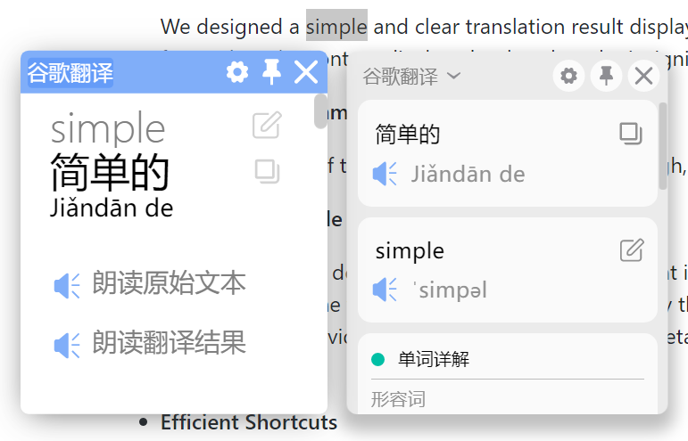
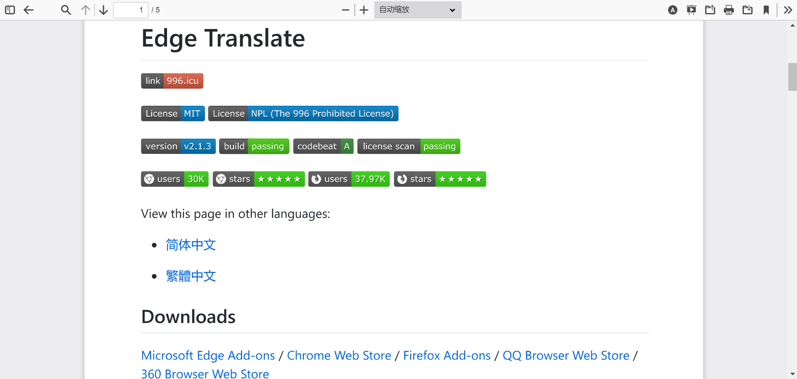
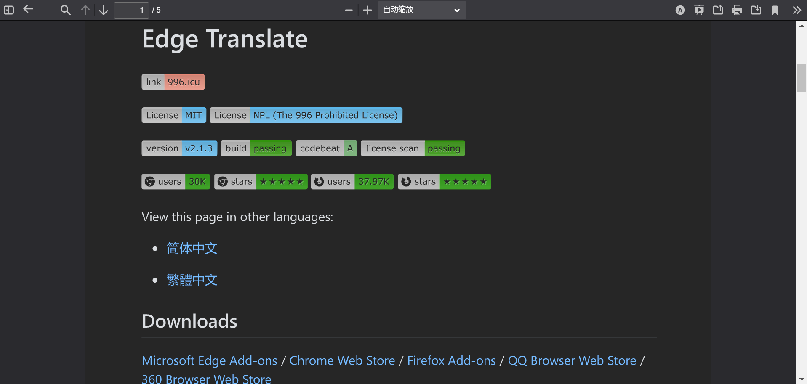

### 注意

* 關於火狐瀏覽器安裝zip格式的擴展包請參攷[這裡](https://github.com/EdgeTranslate/EdgeTranslate/blob/master/docs/wiki/zh_TW/%E8%87%B4%E7%81%AB%E7%8B%90%E7%94%A8%E6%88%B6.md)！

* 為了進一步改善翻譯體驗，我們建立了側邊翻譯用戶交流群，歡迎大家加入：[側邊翻譯](https://t.me/EdgeTranslate)

### 全新設計的翻譯結果展示框

本次更新帶來了 __全新設計__ 的翻譯結果展示框，相比舊版本更加簡潔美觀，並且更有效地利用了空間，同樣大小的展示框可以展示更多的內容！

除了更加美觀高效的展示框樣式，本次更新還帶來了兩個新的功能：

* 展示框中展示的內容可自定義；現在，你可以隱藏掉那些不需要的內容，讓你的翻譯框更加簡潔清晰！

* 支持自動折疊過長的內容；如果翻譯結果中的某些內容過長，你可以選擇將它折疊起來，需要的時候再展開！

### PDF閱讀器支持黑暗模式

本次更新還帶來了對內置PDF閱讀器黑暗模式的支持，暗光下看文獻不再刺眼！

黑暗模式默認自動跟隨系統調整。即，當系統設定為亮色模式時，PDF顯示為正常色彩：

而當系統設定為暗色模式時，PDF將會自動顯示為暗色：

如果你有特殊的需求，那麼點擊PDF閱讀器右上角的 `A` 按鈕即可調整PDF顯示模式，支持 __自動__ ，__始終黑暗__ 以及 __始終原色__ 三種模式。

### 其他優化與修復

* 優化了使用從右到左佈局時的展示效果；

* 更新了谷歌翻譯接口以提供更高質量的翻譯；

* 修復了谷歌翻譯接口發音出錯的問題(#169)；

* 修復了使用Chrome原生PDF閱讀器時，翻譯結果展示框大小失控的問題(#163)；

* 修復了某些場景下劃詞翻譯按鈕無法顯示的問題；

### 支持我們

開發側邊翻譯花費了我們許多的時間和精力，如果你真的覺得這個項目對你有幫助，不妨請我們喝罐可樂，支持我們繼續做下去：[PayPal](https://paypal.me/EdgeTranslate)

當然，這 __純屬自願__，打賞并不會帶來什麽優待，不打賞也不會有影響，請量力而爲！