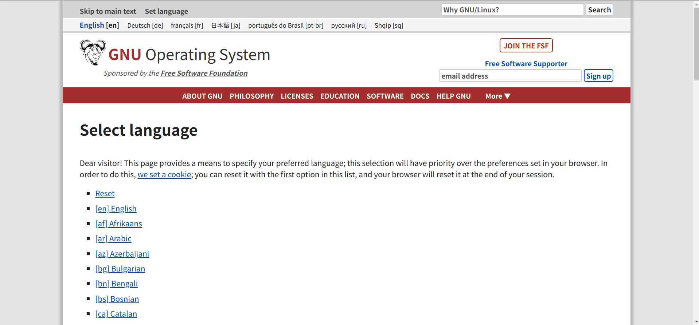

## Edge Translate Instructions

### Word Translation

* Method 1: Select the word or sentence that needs to be translated, click the right mouse button and you'll see the context menu, select `Translate 'xxx'` to view the translation result.

* Method 2: Select the word or sentence that needs to be translated, and click the icon  that pops up near the mouse cursor to translate.

* Method 3: Select the word or sentence that needs to be translated, press the shortcut key to translate ( this shortcut key must be set in [Quick Key Settings](chrome://extensions/shortcuts) before you use it. )

#### About The Immediate Translating After Selecting

If you feel that it is too much trouble to get the translation after clicking the word again, we offer two more radical choices:

* Double-click the word to translate immediately: Enable the 'Double-click word to translate immediately' in the Options of this extension, then just double-click the word you want to translate, and the translation result will be displayed immediately, no more operations are needed.

* Translate immediately after wording: If it can't meet your needs by double-clicking the word, you can also enable 'Translate immediately after wording'. When enabled, the translation result will be displayed immediately after selecting, regardless of the way you select the text.

### Word Query

Click the icon  in the upper right corner of the browser or use the shortcut key (default `Alt + Q`) to input the word or sentence you want to query in the input box of the pop-up page, then click the `Translate` button or press `Enter` to view the translation results.

### Fix Translation Results

* Method 1: If you want to keep the translation result displayed, you can click the pin icon in the upper right corner of the translation result bar to fix the bar. After fixing it, clicking again will cancel the fixation.

* Method 2: Press the shortcut key (default `Alt + X`) to fix the display bar. After fixing it, press the shortcut key again (default `Alt + X`) will cancel the fixation.

### Change Translation Languages

Method 1: Click the icon  in the upper right corner of the browser. There is a downward arrow below the input box in the pop-up page. Click the arrow to expand the language selection page.

Method 2: Click the icon  in the upper right corner of the browser and press the shortcut key (default `Alt + W`) to expand the language selection page. Press again to hide the language selection page.

Method 3: Click the icon  in the upper right corner of the browser and press the shortcut key (default `Alt + S`) to complete the language exchange (__recommended__).

### Web Page Translation

* YouDao web page translation

Using the web page translation API of YouDao Translate, the effect is as follows:

The advantage of YouDao web page translation is that there is no web page restriction, and almost any page can be translated (except for pdf documents); the disadvantage is that it can only be translated into Chinese and the target language cannot be changed.

* Google web page translation

Using the web page translation API of Google Translate, the effect is as follows:

The advantage of Google Translate is that you can freely choose the target language, and the translation speed is usually faster than YouDao Translate. The disadvantage is that some pages cannot be translated, such as Github.

* Precautions

    - Whether you use YouDao web page translation or Google web page translation, you can only translate web pages. __You can't translate pdf files!__

    - Due to the domestic network environment, Google's webpage translation may be unusable. Please use YouDao web page translation when it happens.

### Blacklist Setting

Right click on the icon  in the top right corner of the browser and in the expanded options you can see `Add this site to blacklist` and `Add this domain to blacklist`. Clicking `Add this site to blacklist` will disable word translation and double-click translation on the current page; clicking `Add this domain to blacklist` will disable word translation and double-click translation on all pages with the same domain as the current page.

If the icon  is displayed in the upper right corner of the browser, the domain name of the current page or the url of the current page is in the blacklist. Right click on this icon and you will see `Remove this site from blacklist` or `Remove this domain from blacklist`, and click to re-enable the word translation and double-click translation on the current page.

### Other Settings

Right click on the icon  in the top right corner of the browser and click on `Options` in the pop-up menu to go to the plugin settings page. Here you can set what needs to be displayed in the translation results and enable and disable word translation.

### Advanced usage scenarios

In order to further achieve the goal of convenient translation, we have added a number of shortcuts for Edge Translate. Learn these shortcuts to turn your browser into a convenient word-searching tool.

A typical usage scenario is:

1. On any non-initial page of the browser, press `Alt + Q` to open the search input box.

   * You may need to use `Alt + S` to exchange source and target languages

       + When the source language is `Auto Detect`, the exchange is not supported. Please use the following method to set it manually.

   * Alternatively, you may need to use `Alt + W` to further set the source and target languages.

       + After setting the source or target language, press `Alt + W` again to turn off the language setting and return focus to the input box.

2. Type or paste the word you want to check and press `Enter` to view the translation result.

3. Press `Alt + X` to fix the translation result. Press `Alt + C` to close the translation result.

4. If you are not used to such a shortcut key combination, you can right-click on the icon  in the upper right corner of the browser and click `Shortcut Setting` to enter the shortcut key setting page, where you can customize all the shortcut keys for Edge Translate.