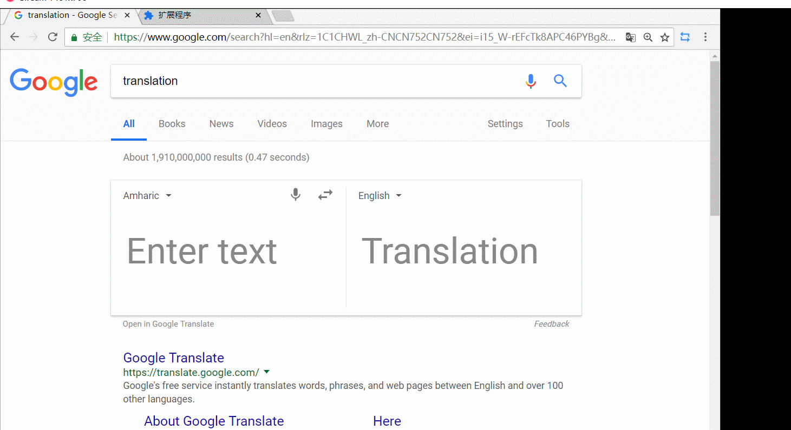

## Edge Translate Q & A

* __В: Есть ли в этом расширении функция xxx? Почему это расширение не может xxx?__

  __О:__ Вот [список](./Введение.md) того, что может это расширение, проверьте!

* __В: У меня возникли проблемы при использовании расширения.__

  __О:__ Пожалуйста, отправьте нам: [nickyc975](mailto:chenjinlong2016@outlook.com), [Mark Fenng](mailto:f18846188605@gmail.com) на почту или наш Github-репозиторий ваш вопрос/проблему.

* __В: Я только что установил/обновил расширение, и оно не работает. Что делать?__

  __О:__ После установки или обновления приложения, необходимо перезагрузить страницы, которые нужно перевести, после этого функция перевода станет доступна.

* __В: Значок перевода не появляется, даже после выделения некоторого текста.__

  __О:__ Вам нужно включить `Enable Select Translate` в настройках, а потом перезагрузить вкладку.

* __В: Как включить функцию перевода в файлах .pdf?__

  __О:__ Для начала вы должны предоставить расширению разрешение на доступ к ссылкам на файлы. Для этого вы можете следовать инструкции __Figure 1__. После предоставления разрешения вы должны включить `Использовать встроенную программу просмотра PDF` в параметрах расширения, а затем, чтобы использовать функции перевода в PDF, обновить вкладки PDF-файла.
  
* __В: Раздражает постоянно всплывающая рамка результата!__

  __О:__ Вы можете нажать значок булавки в правом верхнем углу рамки, чтобы исправить это.

* __В: Почему я не могу установить файл .crx, скачанный со страницы "Release"?__

  __О:__ Если появляется сообщение об ошибке "``Apps, extensions, and user scripts can not be added from this site``", попробуйте выполнить следующее:

  1. В Chrome откройте URL: ``chrome://flags/#extensions-on-chrome-urls``.

  2. Если "``Extensions on chrome:// URLs``" выключено, включите его и перезапустите Chrome.

  3. Откройте этот URL: ``chrome://extensions/``.

  4. Убедитесь, что ``Developer Mode`` включен. Если он выключен, то включите его и перезагрузите страницу.

  Теперь вы можете попробовать снова перетащить файл .crx на эту страницу.

* __В: Почему окно перевода стало плавающим? Как мне вернуть его к правой (левой) стороне?__

  __О:__ Эта новая функция, поддерживающая плавающее окно, была представлена в Edge Tranlste 2.0. Когда вы перемещаете курсор мыши в синюю область в верхней части окна перевода, вы можете перетаскивать его, удерживая левую кнопку мыши.

  Когда окно перевода закреплено сбоку, перетаскивание поля перевода сделает его плавающим.
  
  Если вы хотите снова зафиксировать его сбоку, __перетащите поле перевода вправо (влево), пока курсор мыши не достигнет границы__, это снова зафиксирует его.

  Для примера, смотрите Изображение 2 (это большой GIF-файл, пожалуйста, подождите немного).

* __В: Что делать, если окно перевода находится за пределами интерфейса, и я не вижу перевод?__

  __О:__ Если плавающее окно перевода находится за пределами страницы и не может быть перенесено обратно, вы можете попробовать изменить масштаб страницы, чтобы вернуть его на страницу. Конкретные операции: удерживайте нажатой клавишу Ctrl и одновременно вращайте колесико мыши, чтобы настроить масштаб страницы.

### Изображение 1: Предоставление Edge Translate доступа к ссылкам на файлы

### Изображение 2: Переключение между плавающим и фиксированным режимами

