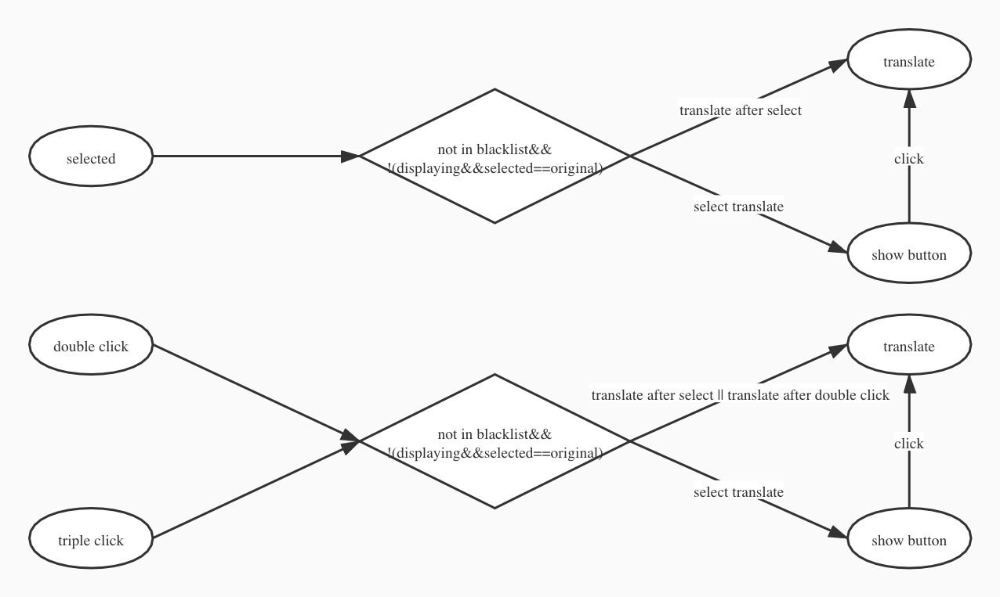

### 项目结构

```
+-- config
|   +-- webpack.base.config.js
|   +-- webpack.dev.config.js
|   +-- webpack.prod.config.js
+-- src
|   +-- contents
|   |   +-- pdf.js
|   |   +-- select.js
|   +-- display
|   |   +-- display.js
|   |   +-- engine.js
|   |   +-- template.js
|   +-- options
|   +-- popup
|   +-- background.js
|   +-- translate.js
+-- static
|   +-- _locales
|   +-- icon
|   +-- pdf
```

#### config

存放 webpack 的三个配置文件，

-   webpack.base.config.js 基础公共配置
-   webpack.dev.config.js 开发环境配置
-   webpack.prod.config.js 生产环境配置

#### contents

其中包含插件的两个 content scripts

-   pdf.js 用于在浏览器读取.pdf 文件时，自动跳转到自带的 pdf 阅读器(引入了[pdf.js](https://github.com/mozilla/pdf.js))
-   select.js 用于实现划词翻译的功能
    -   划词翻译的逻辑示意图

#### display

负责在当前窗口中生成侧边栏，展示翻译结果
在这一模块中，使用了自己编写的简易模板渲染引擎，负责将翻译结果的结构化的数据和静态页面进行渲染，生成用于展示的 html 内容

-   engine.js
    简易渲染引擎(render 函数)
-   tempalte.js
    存放模板内容
-   display.js
    将获得的翻译结果对象使用 render()函数渲染出侧边栏中的页面
    负责生成侧边栏，弹出侧边栏，收回侧边栏

#### options

负责设置界面

#### popup

负责弹出界面
包括'翻译输入框'，源语言和目标语言的选项

#### background.js

负责在插件刚安装时，初始化所有设置项的默认设定，以及运行过程中插件各部分之间的消息转发。

#### translate.js

负责主要的翻译功能

-   发送翻译请求
-   处理返回的数据，将其转换为规整的数据结构
-   将翻译结果对象传给 display 模块，由 display 模块展示翻译结果

#### \_locales

负责插件的国际化，使插件支持多种语言
目前支持中文简体，中文繁体，英语

#### icon

存放图标文件

#### pdf

存放引入的 [pdf.js](https://github.com/mozilla/pdf.js)的文件，在打包时当作静态文件处理

### 消息传递结构

-   **translate.js -> display.js**

    发送方法：`sendMessageToCurrentTab(message)`，见`lib/common.js`

    -   翻译开始通知

        ```
        {
            type: "info",
            info: "start_translating"
        }
        ```

    -   网络错误报告

        ```
        {
            type: "info",
            info: "request_error",
            detail: 错误码
        }
        ```

    -   翻译结果

        ```
        {
            type: "translateResult",
            translateResult: 翻译结果内容
        }
        ```

-   **background.js -> display.js**

    发送方法：`sendMessageToCurrentTab(message)`，见`lib/common.js`

    -   快捷键消息

        ```
        {
            type: "command",
            command: 快捷键名称
        }
        ```

-   **display.js -> background.js**

    发送方法：`chrome.runtime.sendMessage(message, callback)`

    -   需要朗读的文本

        ```
        {
            type: "pronounce",
            text: 待朗读文本,
            language: 文本的语言,
            speed: 朗读语速
        }
        ```

-   **background.js -> select.js**

    发送方法：`sendMessageToCurrentTab(message)`，见`lib/common.js`

    -   快捷键消息

        ```
        {
            type: "command",
            command: 快捷键名称
        }
        ```

-   **select.js -> background.js**

    发送方法：`chrome.runtime.sendMessage(message, callback)`

    -   待翻译文本

        ```
        {
            type: "translate",
            text: 待翻译文本
        }
        ```

-   **pdf.js -> background.js**

    发送方法：`chrome.runtime.sendMessage(message, callback)`

    -   重定向到内置 PDF 阅读器

        ```
        {
            type: "redirect",
            url: 目的url
        }
        ```

-   **google/injection.js -> background.js**

    发送方法：`chrome.runtime.sendMessage(message, callback)`

    -   获取用户语言

        ```
        {
            type: "get_lang"
        }
        ```
