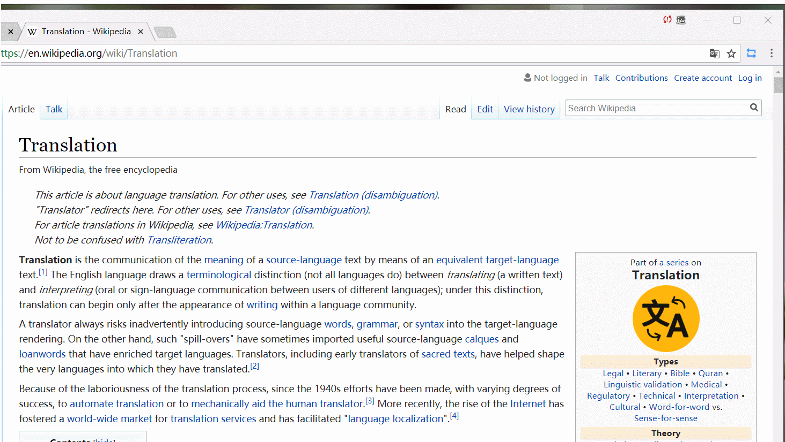
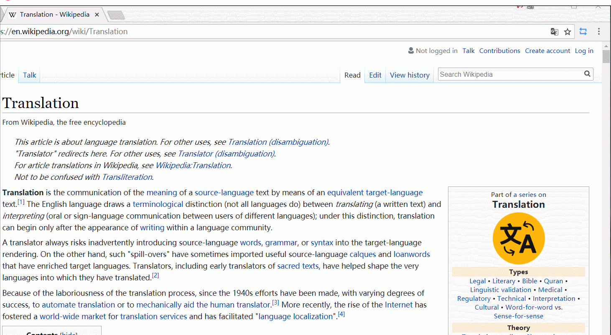
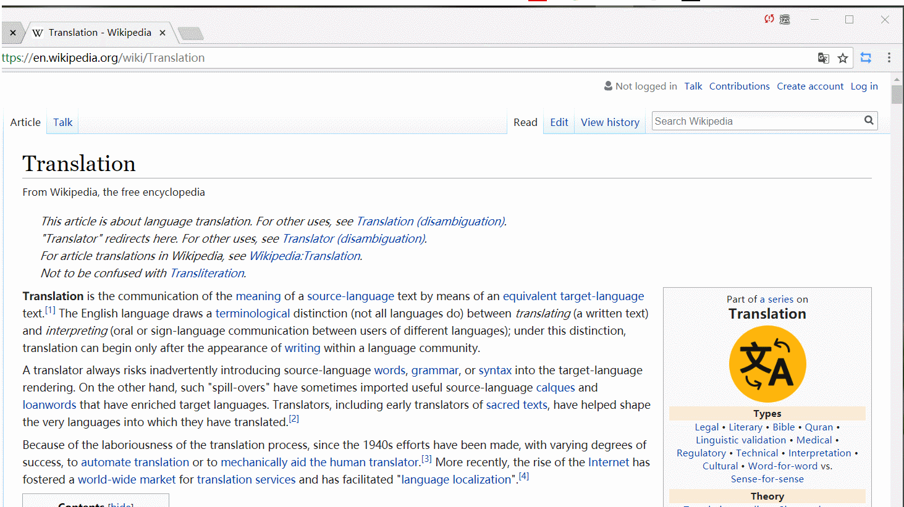
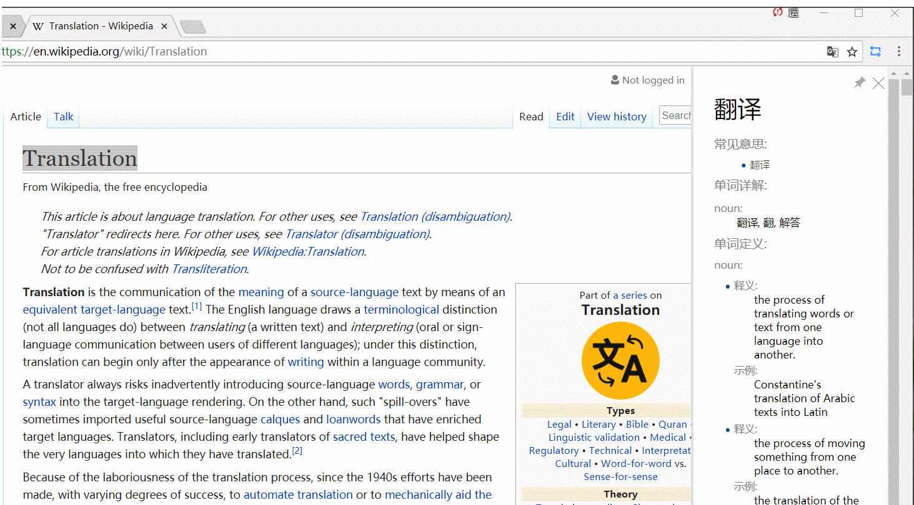
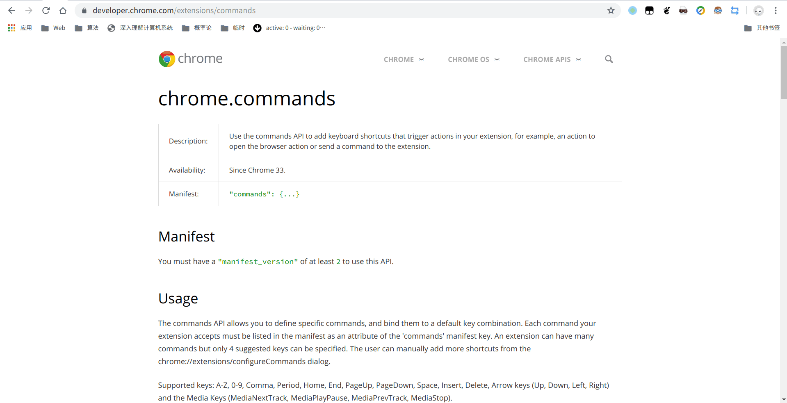
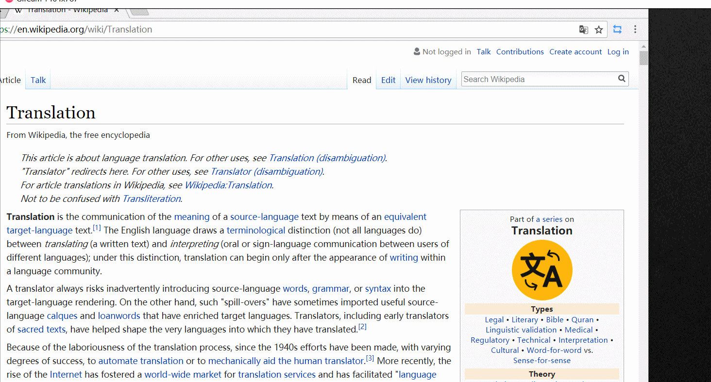

## 側邊翻譯使用說明

### 選詞翻譯

-   方法一：鼠標選中需要翻譯的單詞或句子，點擊鼠標右鍵彈出菜單，選擇 `翻譯 'xxx'` 即可查看翻譯結果。

-   方法二：鼠標選中需要翻譯的單詞或句子，點擊在鼠標光標附近彈出的標誌即可翻譯。

-   方法三：鼠標選中需要翻譯的單詞或句子，按下快捷鍵即可翻譯(此快捷鍵如果要使用，必須先在[快捷鍵設置](chrome://extensions/shortcuts)中自定義快捷鍵)

#### 關於選中單詞立即翻譯

如果你覺得選中單詞後還要再點一次鼠標才能看到翻譯結果太麻煩的話，我們提供了兩種更激進的翻譯方式：

-   雙擊單詞立即翻譯：在本擴展的設置中開啟`雙擊單詞立即翻譯`後，只需要鼠標左鍵雙擊你想翻譯的單詞，就會立刻展示翻譯結果，不需要更多操作

-   劃詞後立即翻譯：如果雙擊單詞立即翻譯還滿足不了你的需求的話，可以考慮啟用`劃詞後立即翻譯`，啟用後不論你以何種方式選中文本，都會立即展示翻譯結果

### 單詞查詢

點擊瀏覽器右上角的標誌或者使用快捷鍵（默認`Alt + Q`），在彈出頁面的輸入框中輸入你想查詢的單詞或句子，然後點擊`翻譯`按鈕或按`Enter`鍵即可查看翻譯結果。

### 固定翻譯結果

-   方法一：如果你想保持翻譯結果展示欄一直顯示，可以點擊翻譯結果展示欄右上角的圖釘標誌來固定展示欄，固定之後再次點擊將取消固定。

-   方法二：按下快捷鍵（默認`Alt + X`），可以將展示欄固定，已經固定後再次按下快捷鍵（默認`Alt + X`）將取消固定

### 設置翻譯語言

方法一：點擊瀏覽器右上角的標誌，在彈出頁面中輸入框的下方有一個向下的箭頭，點擊箭頭即可展開語言設置頁面。

方法二：點擊瀏覽器右上角的標誌，按下快捷鍵（默認`Alt + W`）即可展開語言設置頁面，如果再次按下（默認`Alt + W`）即可隱藏語言設置界面

方法三: 點擊瀏覽器右上角的標誌，按下快捷鍵(默認`Alt + S`)，即可完成語言交換（**推薦使用**）

### 互譯模式

-   **什麼是互譯模式？**

    當用戶主要在兩種語言之間互相轉換時，頻繁交換源語言和目標語言將是非常煩人的一件事，因此我們推出了互譯模式。在互譯模式下，用戶選中文本後插件會自動檢測文本的語言，然後根據用戶的設定將文本翻譯到相對應的另一種語言。

    例如：用戶將源語言設定為英文，將目標語言設定為中文，然後開啟互譯模式，那麼當用戶選中非中文的文本時，文本將會被翻譯為中文，當用戶選中中文文本時，文本將被翻譯成英文。

    **注意：** 當源語言設定為自動檢測時，互譯模式將會被強制關閉並且無法開啟！

-   **怎麼開啟/關閉互譯模式？**

    點擊瀏覽器右上角的標誌，然後點擊彈出框中的那個向下的箭頭，即可看到互譯模式的開關。

    互譯模式也支持使用快捷鍵開啟/關閉，但快捷鍵需要手動設置，並且只有在右上角彈出框開啟的情況下才有效。

-   **示例**

### 網頁翻譯

-   有道網頁翻譯

我們過去支持有道網頁翻譯，但是由於官方停止了網頁翻譯功能，所以我們只能也將其移除。

-   谷歌網頁翻譯

使用谷歌翻譯的網頁翻譯接口，效果如圖：

谷歌翻譯的優點是可以自由選擇目標語言，並且翻譯速度通常更快。

-   注意事項

    -   網頁翻譯還只能翻譯網頁，**不能翻譯 pdf 文件！**

### 黑名單設置

右鍵點擊瀏覽器右上角的標誌，在展開的選項中可以看到`將當前頁面添加到黑名單`以及`將當前域名添加到黑名單`。點擊`將當前頁面添加到黑名單`會禁用當前頁面上的劃詞翻譯和雙擊翻譯功能；點擊`將當前域名添加到黑名單`會禁用與當前頁面同一域名的所有頁面上的劃詞翻譯和雙擊翻譯功能。

如果瀏覽器右上角顯示的是這個標誌，說明當前頁面或當前頁面的域名在黑名單中，此時右鍵點擊這個標誌將會看到`將當前頁面移出黑名單`或`將當前域名移出黑名單`，點擊即可重新啟用當前頁面上的劃詞翻譯和雙擊翻譯功能。

### Vimium 支援

我們已經將[Vimium C](https://github.com/gdh1995/vimium-c)集成到了我們的 PDF 閱讀器中， 如果你習慣於使用 vimium 來操作瀏覽器，我們推薦你使用[Vimium C](https://github.com/gdh1995/vimium-c)。

### 其他設置

右鍵點擊瀏覽器右上角的標誌，在彈出選項中點擊`選項`進入插件的設置頁面。在這裡你可以設置翻譯結果中需要展示的內容以及啟用和禁用劃詞翻譯。

### 高級使用場景

為了更進一步實現便捷翻譯的目標，我們為側邊翻譯添加了許多快捷鍵。學會這些快捷鍵，即可將你的瀏覽器變成一個方便的查詞軟件。

一個典型的使用場景是：

1. 在瀏覽器的任意非初始頁面，按`Alt + Q`打開查詞輸入框；

    - 你可能需要使用`Alt + S`交換源語言和目標語言

        - 當源語言是`自動檢測`時不支持交換，請使用下面的方法手動設置

    - 或者，你可能需要使用`Alt + W`來進一步設置源語言和目標語言

        - 設置好源語言或目標語言後，再次按`Alt + W`即可關閉語言設置並使焦點回到輸入框

2. 輸入或粘貼想要查的詞，按下`Enter`鍵查看翻譯結果；

3. 按`Alt + X`可將翻譯結果固定，按`Alt + C`可將翻譯結果關閉；

4. 如果你不習慣這樣的快捷鍵組合，可以`右鍵`點擊瀏覽器右上角的標誌，在彈出選項中點擊`快捷鍵設置`進入快捷鍵設置頁面，在這裡你可以對側邊翻譯的所有快捷鍵進行自定義。
